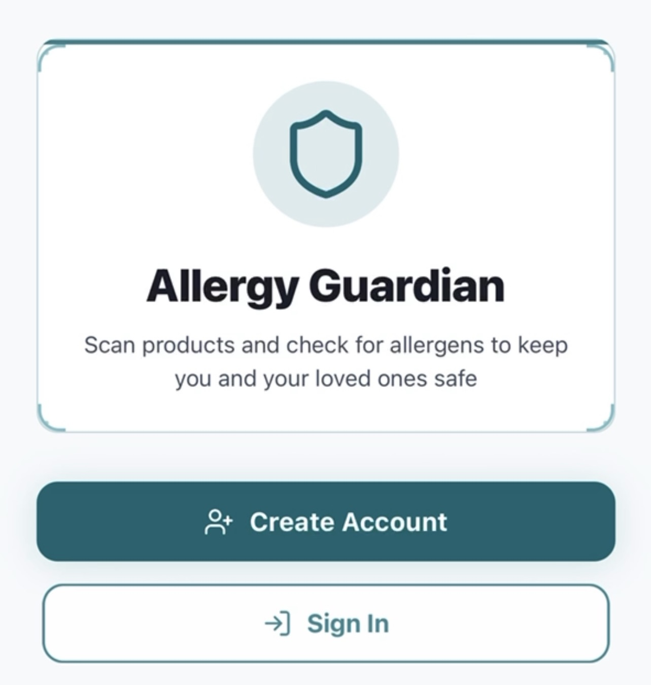
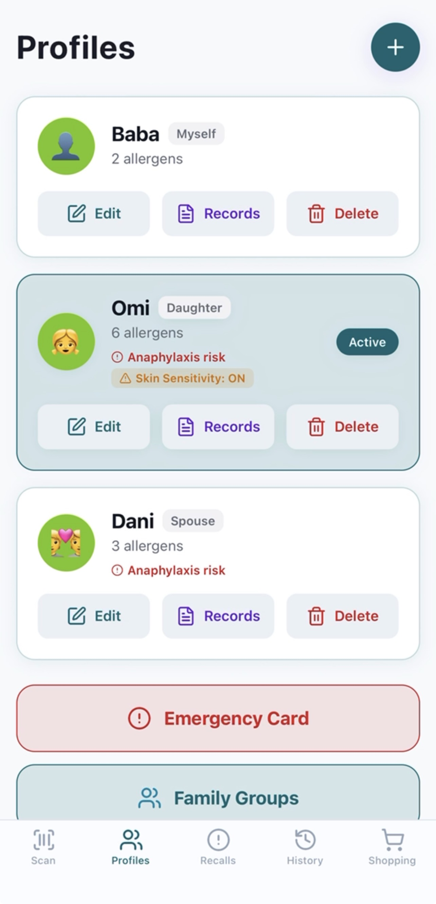
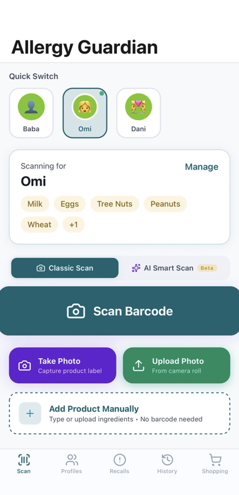
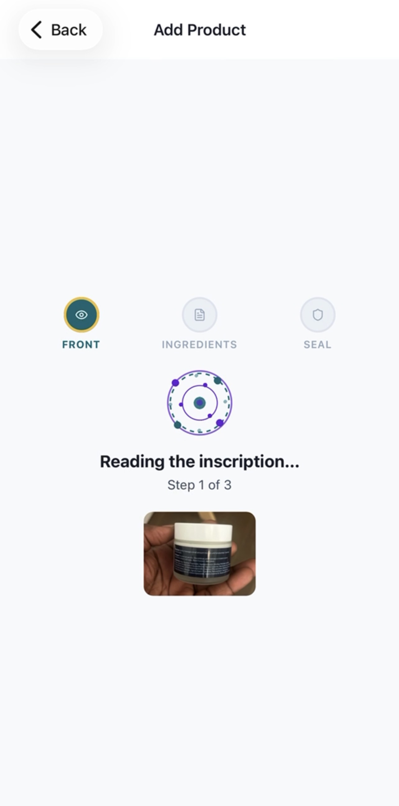
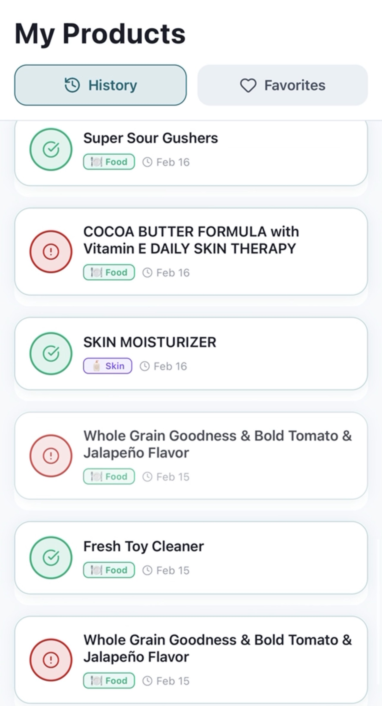

# 🛡️ SafeBite

## Overview
SafeBite is a mobile app that helps users scan food and beauty products to detect allergens, ingredients, and safety concerns in real time.

## Why I Built It
SafeBite was designed to make product safety easier for people with allergies and sensitivities by combining barcode scanning, product lookup, and clear ingredient visibility.

## Features
- Barcode-based product lookup
- Ingredient and allergen detection
- Mobile-friendly experience
- Cached product results for faster repeat searches
- Built for real-world daily use

## 📸 App Preview

### 🛡️ Allergy Guardian (Home)

### 👨‍👩‍👧 Multi-Profile Safety System

### 📷 Smart Scanning

### 🧠 AI Processing Pipeline

### 📊 Scan Results & History

## Tech Stack
- React Native
- Expo
- TypeScript
- Supabase
- External product APIs

## What I Learned
- Structuring a mobile app around real user safety needs
- Working with third-party APIs and fallback logic
- Designing app flows that balance speed, trust, and usability

## Status
In active development and being expanded with stronger UX, better product intelligence, and improved reliability.

## Author
Babatunde Jegede
